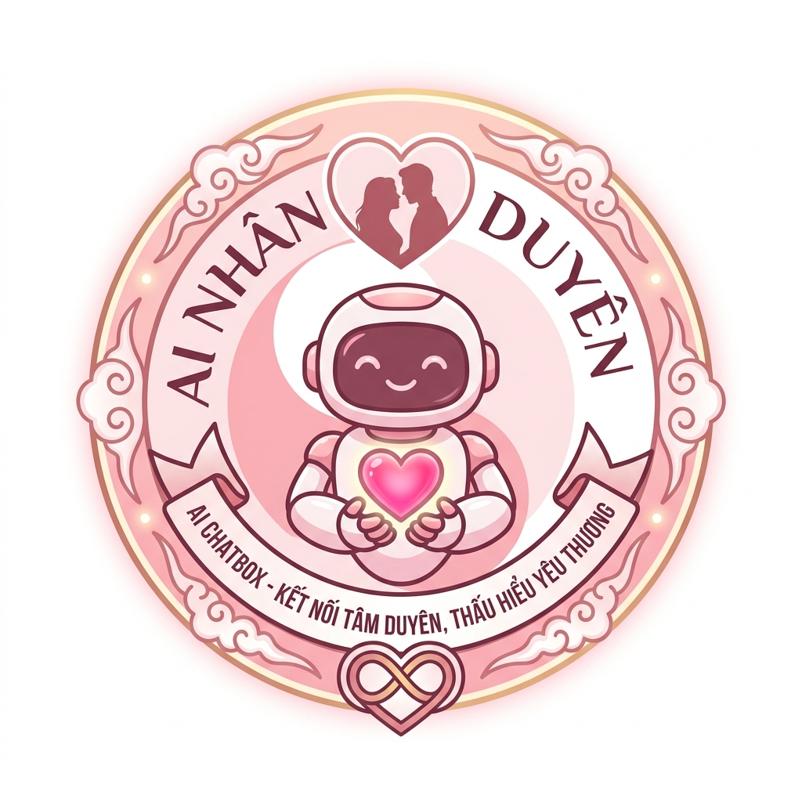

# 🌸 AI Nhân Duyên — Kết Nối Tâm Duyên, Thấu Hiểu Yêu Thương

<p align="center">
  
</p>

<p align="center">
  <strong>Nền tảng trí tuệ nhân tạo chuyên sâu về luận giải hòa hợp nhân duyên vợ chồng, tình yêu và gia đạo theo hệ thống Âm Dương – Ngũ Hành khoa học và đa tầng.</strong>
</p>

<p align="center">
  <a href="#-tính-năng-nổi-bật"></a>
  <a href="#-kiến-trúc-kỹ-thuật"></a>
  <a href="#-kiến-trúc-kỹ-thuật"></a>
  <a href="#-kiến-trúc-kỹ-thuật"></a>
  <a href="#-kiến-trúc-kỹ-thuật"></a>
  <a href="#-tác-giả--liên-hệ"></a>
</p>

---

## 📖 Giới Thiệu Tổng Quan

Trong văn hóa phương Đông, hôn nhân và gia đạo là nền tảng của hạnh phúc bền vững. Tuy nhiên, việc xem tuổi truyền thống thường bị đơn giản hóa thành những phép so sánh cơ học thô thiển (như chỉ so mệnh nạp âm, hay quy kết "tứ hành xung là xấu"), gây ra tâm lý hoang mang, sợ hãi không đáng có.

**AI Nhân Duyên** ra đời nhằm số hóa và tái định hình phương pháp luận cổ truyền theo tư duy **Khoa Học – Đa Tầng – Nhân Văn**:
- **Không dùng 1 yếu tố đơn lẻ** để kết luận toàn bộ số phận một mối quan hệ.
- **Xung không đồng nghĩa với ly hôn; Hợp không đồng nghĩa với tốt tuyệt đối.**
- Phân định rạch ròi giữa **Thiên Can (Khí)**, **Địa Chi (Động)**, **Nạp Âm (Lục Thập Hoa Giáp)** và **Cung Mệnh (Bát Trạch)**.
- Tập trung vào quy luật **Sinh – Khắc – Chế – Hóa**, cung cấp giải pháp chuyển hóa, cải thiện giao tiếp và bồi đắp đức hạnh gia đình.

> 💡 **Triết lý cốt lõi:**  
> *"Một người không phải chỉ là một cái tuổi. Huyền học là hệ thống tham khảo nhận diện khuynh hướng năng lượng; còn chất lượng hôn nhân thực tế phụ thuộc vào tính cách, trách nhiệm, sự thấu hiểu, đạo đức và cách hai người cùng nhau xử lý khác biệt."*

---

## 🌟 Phương Pháp Luận 6 Tầng Chuẩn Mực

```
┌────────────────────────────────────────────────────────────────────────┐
│                        AI NHÂN DUYÊN ENGINE                            │
├────────────────────────────────────────────────────────────────────────┤
│  TẦNG 1: THIÊN CAN (TẦNG KHÍ)                                          │
│  ↳ Khảo sát tương tác Khí: Hợp – Sinh – Khắc – Tỷ hòa                   │
├────────────────────────────────────────────────────────────────────────┤
│  TẦNG 2: ĐỊA CHI (TẦNG ĐỘNG)                                           │
│  ↳ Khảo sát vận động sinh hoạt: Tam Hợp, Lục Hợp, Lục Xung, Hại, Phá   │
├────────────────────────────────────────────────────────────────────────┤
│  TẦNG 3: NGŨ HÀNH NỘI TẠI                                              │
│  ↳ Phân tích Ngũ Hành gốc của Thiên Can và Địa Chi                      │
├────────────────────────────────────────────────────────────────────────┤
│  TẦNG 4: NẠP ÂM LỤC THẬP HOA GIÁP                                      │
│  ↳ Quy chiếu 60 Hoa Giáp, phân biệt rõ Nạp Âm với Can và Chi          │
├────────────────────────────────────────────────────────────────────────┤
│  TẦNG 5: CUNG MỆNH BÁT TRẠCH                                           │
│  ↳ Phối Cung Phi (Sinh Khí, Thiên Y, Diên Niên, Phục Vị / Tuyệt Mệnh..)│
├────────────────────────────────────────────────────────────────────────┤
│  TẦNG 6: TỔNG HỢP CẤU TRÚC & KHUYẾN NGHỊ THỰC TẾ                       │
│  ↳ Điểm Thuận (+) & Điểm Nghịch (-) & Hóa Giải (Sinh Khắc Chế Hóa)     │
└────────────────────────────────────────────────────────────────────────┘
```

1. **Tầng 1 — Thiên Can (Tầng Khí):** Khảo sát quan hệ trời định, tính chất khí quyển bao bọc (Giáp Kỷ hợp Thổ, Ất Canh hợp Kim, Bính Nhâm tương khắc, v.v.).
2. **Tầng 2 — Địa Chi (Tầng Động):** Khảo sát đời sống thực tế, nếp sinh hoạt hàng ngày (Thân Tý Thìn tam hợp Thủy, Dần Thân Tỵ Hợi tứ xung, Mão Thìn tương hại, v.v.).
3. **Tầng 3 — Ngũ Hành Nội Tại:** Xét tính chất ngũ hành của Can phối Chi để đánh giá sự hòa hợp nội tại của từng cá nhân.
4. **Tầng 4 — Nạp Âm Lục Thập Hoa Giáp:** Xét 60 nạp âm (Hải Trung Kim, Lư Trung Hỏa, Đại Lâm Mộc...) theo đúng tính chất vật lý của khí âm dương.
5. **Tầng 5 — Cung Mệnh Bát Trạch:** Tính toán Cung Phi Bát Trạch (Đông Tứ Mệnh vs Tây Tứ Mệnh) để định hướng phong thủy không gian gia đạo.
6. **Tầng 6 — Cấu Trúc Tổng Hợp:** Đánh giá tổng thể Điểm Thuận, Điểm Nghịch và các Lưu Ý cụ thể kèm lời khuyên hành động thực tế.

---

## ✨ Tính Năng Nổi Bật

- 🤖 **Trợ Lý AI Chatbox Đa Nền Tảng & Tự Động Luân Chuyển (Smart Auto-Fallback):**
  - **Chế độ tự động chọn mô hình (Auto-Fallback):** Tự động chọn mô hình tối ưu nhất và tự động xoay vòng qua các mô hình dự phòng (Gemini 2.5 Flash, DeepSeek Chat, Llama 3.3 70B Free, Qwen 2.5 72B Free, Gemini 2.0 Flash Exp Free) khi một mô hình hết lượt miễn phí hoặc quá tải.
  - Hỗ trợ người dùng lựa chọn thủ công mô hình yêu thích hoặc kết nối khóa API cá nhân.
  - Tích hợp công cụ **Offline Cổ Thư Reasoner** hoạt động độc lập ngay cả khi không có kết nối internet hoặc hết quota API.
- 🔮 **Lập Quẻ & Khảo Sát Hòa Hợp Nhân Duyên:**
  - Nhập năm sinh và tháng sinh âm lịch của hai vợ chồng/cặp đôi.
  - Tự động lập bảng phân tích 6 tầng chi tiết kèm thông điệp cốt lõi và phương pháp chế hóa âm dương.
- 📚 **Cẩm Nang Cổ Thư Số Hóa:**
  - Tra cứu 60 Hoa Giáp Nạp Âm toàn thư.
  - Tra cứu 12 Cung Trường Sanh trong hôn nhân (Trường Sanh, Mộc Dục, Quan Đới, Lâm Quan, Đế Vượng, Suy, Bệnh, Tử, Mộ, Tuyệt, Thai, Dưỡng).
  - Tra cứu Thập Can phối Thập Nhị Chi theo bí truyền Cao Ly Đầu Hình & Diễn Cầm Tam Thế.
- 🔑 **Quản Lý API Key An Toàn:**
  - Người dùng có thể nhập khóa cá nhân OpenRouter API Key.
  - Dữ liệu lưu an toàn trong trình duyệt (LocalStorage), không lưu trữ trái phép trên máy chủ trung gian.
- 📜 **Lịch Sử Phiên Bản & Changelog Đầy Đủ:**
  - Tích hợp cửa sổ tra cứu lịch sử phát hành (Changelog) tương tác ngay trên giao diện.

---

## 🛠️ Kiến Trúc Kỹ Thuật (Tech Stack)

- **Frontend:**
  - [React 19](https://react.dev/) — Thư viện xây dựng giao diện tương tác hiện đại.
  - [TypeScript 5.8](https://www.typescriptlang.org/) — Đảm bảo an toàn kiểu dữ liệu chặt chẽ.
  - [Tailwind CSS v4](https://tailwindcss.com/) — Hệ thống tiện ích tạo kiểu nhanh và tinh tế.
  - [Lucide Icons](https://lucide.dev/) — Bộ biểu tượng vector sắc nét.
  - [Motion](https://motion.dev/) — Hiệu ứng chuyển động mượt mà.
  - [Canvas Confetti](https://www.npmjs.com/package/canvas-confetti) — Hiệu ứng chúc mừng quẻ duyên cát lành.
- **Backend & Middleware:**
  - [Express.js](https://expressjs.com/) — Máy chủ proxy an toàn cho API AI.
  - [Vite 6.2](https://vite.dev/) — Môi trường phát triển và đóng gói tối ưu.
  - [Esbuild](https://esbuild.github.io/) — Đóng gói máy chủ Node.js hiệu năng cao.
- **AI SDK & Integration:**
  - [@google/genai](https://www.npmjs.com/package/@google/genai) — SDK chính thức của Google Gemini API.
  - OpenRouter API REST Integration — Cổng giao tiếp đa mô hình ngôn ngữ lớn.

---

## 🚀 Hướng Dẫn Cài Đặt & Chạy Cục Bộ (Local Development)

### 1. Yêu cầu môi trường
- Node.js version 18.0 trở lên
- Trình quản lý gói `npm` hoặc `pnpm` / `yarn`

### 2. Tải mã nguồn về máy
```bash
git clone https://github.com/nguyenhoangdang/ai-nhan-duyen.git
cd ai-nhan-duyen
```

### 3. Cài đặt các gói phụ thuộc
```bash
npm install
```

### 4. Cấu hình biến môi trường
Tạo file `.env` tại thư mục gốc (tham khảo `.env.example`):
```env
# Google Gemini API Key (tùy chọn cho server backend)
GEMINI_API_KEY=your_gemini_api_key_here

# OpenRouter API Key (tùy chọn)
OPENROUTER_API_KEY=your_openrouter_api_key_here
```
*(Lưu ý: Người dùng cũng có thể nhập API Key trực tiếp trên giao diện cài đặt của ứng dụng).*

### 5. Khởi chạy máy chủ phát triển (Dev Server)
```bash
npm run dev
```
Ứng dụng sẽ chạy tại địa chỉ: `http://localhost:3000`

### 6. Đóng gói cho môi trường Production (Build & Start)
```bash
npm run build
npm start
```

---

## 📁 Cấu Trúc Thư Mục Dự Án (Project Structure)

```
ai-nhan-duyen/
├── public/
│   ├── logo.png                # Logo thương hiệu AI Nhân Duyên chính thức
│   └── favicon.ico
├── src/
│   ├── components/             # Các thành phần giao diện React
│   │   ├── AIChatbotModal.tsx  # Cửa sổ trợ lý AI nổi
│   │   ├── AboutView.tsx       # Tab Giới thiệu & Lịch sử phiên bản
│   │   ├── AncientLibraryView.tsx # Cẩm nang Cổ Thư tra cứu
│   │   ├── ApiKeySettingsModal.tsx# Cài đặt OpenRouter Key & Model
│   │   ├── ChatbotView.tsx     # Khung trò chuyện đàm đạo chính
│   │   ├── CoupleLookupView.tsx# Khảo sát & phân tích hòa hợp 6 tầng
│   │   ├── Footer.tsx          # Chân trang & liên kết phiên bản
│   │   ├── Navbar.tsx          # Thanh điều hướng trên cùng & badge v2.1.0
│   │   └── VersionHistoryModal.tsx # Cửa sổ xem toàn bộ Changelog
│   ├── data/                   # Dữ liệu tri thức và thuật toán
│   │   ├── ancientReasoner.ts  # Bộ suy luận logic offline
│   │   ├── caolyData.ts        # Tri thức Cao Ly Đầu Hình
│   │   ├── metaphysicsData.ts  # Tri thức Âm Dương Ngũ Hành & 24 Tiết Khí
│   │   ├── tamtheData.ts       # Tri thức Diễn Cầm Tam Thế (1952)
│   │   └── versionHistory.ts   # Quản lý số phiên bản & lịch sử cập nhật
│   ├── services/
│   │   ├── aiChatClient.ts     # Client gửi yêu cầu AI (OpenRouter/Gemini)
│   │   └── coupleAnalysis.ts   # Thuật toán phân tích 6 tầng Can Chi Nạp Âm
│   ├── types.ts                # Định nghĩa kiểu dữ liệu TypeScript
│   ├── App.tsx                 # Thành phần gốc ứng dụng
│   ├── main.tsx                # Điểm khởi chạy React
│   └── index.css               # Tệp định kiểu Tailwind CSS
├── server.ts                   # Máy chủ Express & Vite middleware
├── metadata.json               # Metadata ứng dụng Google AI Studio
├── AGENTS.md                   # Hướng dẫn ghi nhớ cập nhật cho AI Agent
├── package.json                # Quản lý phiên bản và thư viện
└── README.md                   # Tài liệu dự án GitHub
```

---

## 📜 Lịch Sử Phiên Bản (Changelog)

| Phiên Bản | Ngày Phát Hành | Mật Danh | Nội Dung Nổi Bật |
| :--- | :---: | :--- | :--- |
| **v2.4.2** | 31/08/2026 | **Hoàn Thiện Tàng Kinh Các** | Khắc phục hoàn toàn lỗi ẩn/mất tab và nội dung trong Cẩm Nang Cổ Thư trên di động; sửa lỗi cuộn thanh tab và tối ưu hiển thị 8 hướng Du Niên. |
| **v2.4.1** | 31/08/2026 | **Tương Thích Toàn Diện Di Động** | Khắc phục triệt để hiện tượng mất cân đối hiển thị trên thiết bị di động; tối ưu hóa thanh điều hướng Navbar và khung đàm đạo vừa vặn 100% viewport. |
| **v2.4.0** | 31/08/2026 | **Tinh Gọn Tâm Duyên & Tối Ưu Trải Nghiệm** | Lược bỏ chuyên mục "Lập Quẻ Duyên Nợ" để tinh gọn thanh điều hướng; chuyển giao toàn diện khả năng luận giải 6 tầng vào AI Chatbox; chuẩn hóa thuật ngữ luận giải nhân duyên nhân văn. |
| **v2.3.0** | 31/08/2026 | **Bát Trạch Khai Hoa & Tri Thức Ưu Tiên** | Bổ sung Cung Mệnh Bát Trạch và 8 Hướng Du Niên vào Cổ Thư; Công cụ tra cứu trực tuyến số dư chia 9; Kích hoạt Chỉ Thị Tối Cao ưu tiên nguồn tri thức nội bộ ứng dụng cho AI Chatbox. |
| **v2.2.0** | 31/08/2026 | **Tự Động Luân Chuyển (Smart Auto-Fallback)** | Tự động chọn mô hình và tự động chuyển đổi mô hình dự phòng khi hết gói miễn phí (Gemini, DeepSeek, Llama 3.3 Free, Qwen 2.5 Free, Gemini Flash Free). |
| **v2.1.0** | 31/08/2026 | **Tâm Duyên Toàn Bích** | Chuẩn hóa nhận diện Logo chính thức, tạo hệ thống Changelog & tài liệu GitHub README hoàn chỉnh, thiết lập cơ chế tự động ghi nhớ cập nhật (`AGENTS.md`). |
| **v2.0.0** | 30/08/2026 | **Đa Tầng Âm Dương** | Chuyển đổi toàn diện sang phương pháp luận 6 tầng phân tích; xóa bỏ chấm điểm cơ học; thiết lập triết lý *"Một người không phải chỉ là một cái tuổi"*. |
| **v1.5.0** | 25/08/2026 | **Đa Trí Tuệ Mở** | Tích hợp OpenRouter đa mô hình (Gemini, Claude, GPT, DeepSeek, Qwen), quản lý API Key an toàn trong LocalStorage. |
| **v1.0.0** | 15/08/2026 | **Khởi Sinh Duyên Định** | Số hóa Diễn Cầm Tam Thế (1952) và Cao Ly Đầu Hình, ra mắt giao diện lập quẻ duyên nợ và trợ lý đàm đạo AI ban đầu. |

---

## 📌 Quy Tắc Ghi Nhớ Cập Nhật (Version Maintenance Rule)

Theo quy định dự án trong file `AGENTS.md`:
1. **Bắt buộc tăng số phiên bản** (`SemVer`: `vMAJOR.MINOR.PATCH`) khi có cập nhật tính năng, cải tiến hoặc sửa lỗi.
2. **Đồng bộ hóa 4 vị trí**:
   - `src/data/versionHistory.ts` (Thêm mục vào mảng `VERSION_HISTORY` và cập nhật `APP_INFO.currentVersion`).
   - `package.json` (`"version": "X.Y.Z"`).
   - `README.md` (Cập nhật badge phiên bản & bảng Changelog).
   - `metadata.json` (Đồng bộ mô tả tính năng mới nếu có).

---

## 👨‍💻 Tác Giả & Liên Hệ

- **Tác giả & Nhà phát triển:** Nguyễn Hoàng Đăng
- **Email:** [nguyenhoangdang25@gmail.com](mailto:nguyenhoangdang25@gmail.com)
- **Dự án:** [AI Nhân Duyên (GitHub Repository)](https://github.com/nguyenhoangdang/ai-nhan-duyen)

---

## ⚖️ Giấy Phép & Miễn Trừ Trách Nhiệm (Disclaimer)

- **Bản quyền:** Phát hành theo giấy phép mã nguồn mở [MIT License](LICENSE).
- **Miễn trừ trách nhiệm:** *Ứng dụng AI Nhân Duyên được xây dựng cho mục đích tham khảo văn hóa cổ truyền, giáo dục tâm lý hôn nhân và chiêm nghiệm triết lý sống. Mọi quyết định quan trọng trong cuộc sống và hôn nhân nên dựa trên sự gắn kết, tôn trọng, thấu hiểu lẫn nhau và thực tế khách quan.*

<p align="center">
  🌸 <em>Chúc cho muôn nhà hòa hợp thuận hòa, trăm năm hạnh phúc vẹn tròn!</em> 🌸
</p>
